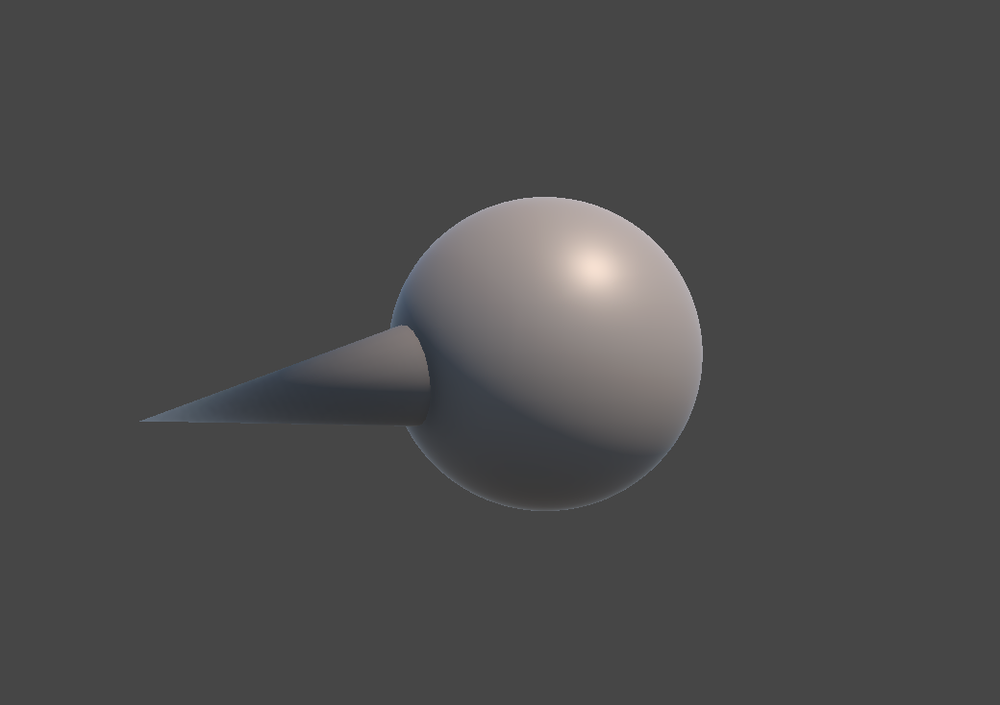
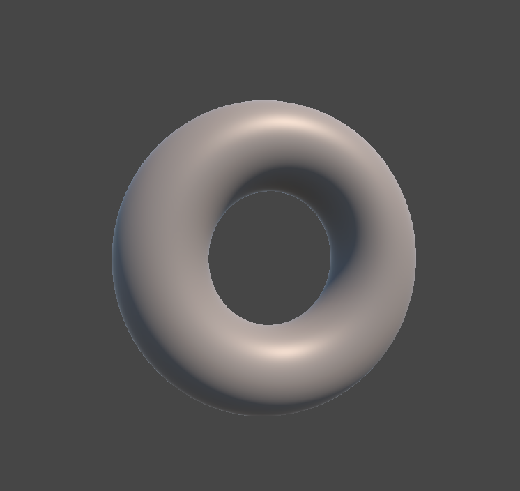

# Unity Developer Test Task

**Unity Version:** 2022.3.38f1 LTS  
**AR Software:** MRTK3 (Mixed Reality Toolkit 3)

---

## 🚀 Features

### 1. Procedural Mesh Creation

- **Object A**: A custom mesh composed of a sphere and a forward-facing cone.
  - The sphere is created by generating a cube and inflating it by normalizing its vertices.
  - Each face of the cube is generated separately and assembled using cross products.
  - A vertex map (`Dictionary`) ensures shared vertices between faces are not duplicated.
  - A cone is appended to represent the forward direction.



- **Object B**: A torus built procedurally.
  - Circular cross-sections are rotated around the torus’ vertical axis to define its geometry.



### 2. Lissajous Curve Animation

- Both objects animate in the XY plane using parametric Lissajous formulas:
  ```
  x = A * sin(a * t + δ)
  y = B * sin(b * t)
  ```

- Parameters vary per object, giving the appearance of random, non-repeating motion.
- Curve parameters are periodically randomized and transitioned smoothly via `Mathf.Lerp()` to enhance aperiodicity.

### 3. Object Rotation

- Object A dynamically rotates to face Object B using a fixed angular speed.
- Additionally, Object A orbits Object B in the XY plane for enhanced visual complexity.

### 4. Dynamic Color Change

- The color of Object A changes based on the angle between its forward vector and the direction to Object B.
  - **Red** when B is in front.
  - **Blue** when B is behind.
- Calculated using:
  ```csharp
  float t = (Vector3.Dot(forward, toTarget) + 1) / 2;
  Color.Lerp(blue, red, t);
  ```

### 5. Mesh Vertex Animation with Perlin Noise

- Object A’s mesh is animated organically using Perlin noise.
- Vertices are displaced along their normals based on noise values.
- Movement is centered around original vertex positions to maintain shape.

---

### Effect


## 🕶️ AR Integration with MRTK3

### Project Setup

- MRTK3 was integrated following official documentation:  
  https://learn.microsoft.com/en-us/windows/mixed-reality/mrtk-unity/mrtk3-overview/getting-started/overview
- Installed via **Mixed Reality Feature Tool for Unity**.
- MRTK3 provides **Input Simulation**, allowing development and testing without physical XR hardware.

### AR Functionality

#### World-Locked Positioning

- **Object B** is set to always appear in front of the user using:
  - `SolverHandler` (for target tracking and offset).
  - `Follow` component (for position tracking).

#### Interactive Attractors

- Used `ObjectManipulator` for hands-on interaction.
- A custom class `AttractorLogic` (derived from `ManipulationLogic<Vector3>`) was created to:
  - Pause Lissajous movement and rotation on interaction.
  - Resume animations after the selection ends via the `selectExited` event.

#### Hand-Specific Interaction

- Implemented `HandFilter` (based on `IXRSelectFilter`) to restrict:
  - **Object A** to the **right hand**.
  - **Object B** to the **left hand**.
- Configured in the `ObjectManipulator > Starting Select Filters`.

## Final Effect


---

## 🧪 How to Run

1. Clone the repository:
   ```bash
   git clone https://github.com/MarcelFojk/Test-Task---Unity-Developer.git
   ```

2. Open the project in **Unity 2022.3.38f1**.

3. Open the **ARScene** scene located in ```./Assets/Scenes```

3. No XR device is required — MRTK3 provides full simulation via keyboard and mouse.

4. Play the main scene and use simulated input to test AR behaviors.

---